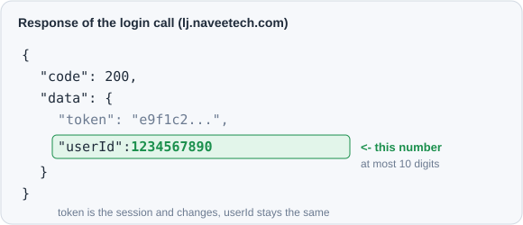
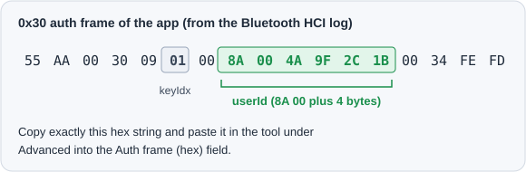

# Guide

A step-by-step walkthrough of the Laufbursche NAVEE Tool. The page talks to your NAVEE scooter over Web Bluetooth, entirely on your device. Nothing is sent to any server.

## What you need

- A NAVEE scooter (the kick-scooter line, for example the XT5). Turn it on and keep it within a few meters.
- A browser with Web Bluetooth: **Chrome** or **Edge** on Android or desktop, or **Bluefy** on iPhone/iPad. Safari and Firefox do not support Web Bluetooth.
- Bluetooth switched on. On Android, location permission has to be granted to the browser for a Bluetooth scan.

## Which devices it works with

The tool speaks the standard NAVEE scooter protocol, the same one the official app uses for the whole scooter line. The authentication keys are shared across these scooters, so the tool talks to any of them, not only the XT5. NAVEE e-bikes and the Exo line use different Bluetooth protocols and are **not** covered.

## One time: find your NAVEE account userId

Your scooter is bound to a NAVEE account. To connect, the tool needs the **numeric account userId** of that account. A bound scooter rejects any other id with **error 255**, before it even answers.

Important:

- This is **not** the Navee ID from the account screen (that one is alphanumeric and often 13 digits). What is needed is a plain number of **at most 10 digits**.
- The app never shows this number, you read it once. After that the tool remembers it in the browser, so you only ever do this a single time.
- The number **never changes**. Only a different NAVEE account has a different number.

You are looking for the field userId in the response of the login call:

### iPhone (easiest, no computer at all)

The NAVEE app has no cert pinning and iOS trusts a self-installed certificate.

1. Install an on-device HTTPS capture app from the App Store, for example Http Catcher or Stream.
2. Install its certificate profile under Settings -> General -> VPN & Device Management, then set it to full trust under Settings -> General -> About -> Certificate Trust Settings.
3. Start the capture, then open the NAVEE app and log in (if needed, log out plus log back in once).
4. Open the call to lj.naveetech.com named login and read the field userId in its response.
5. Enter the number in the tool at the top in the NAVEE account userId field. Tip: you can also paste the whole copied response text here, the tool extracts the userId automatically.

### Android (without root you need a PC once)

On Android the app trusts only system certificates. A plain on-device proxy like PCAPdroid therefore needs root.

BLE variant (most robust, no root needed):

1. Enable the Bluetooth HCI snoop log in Developer options, then switch Bluetooth off plus on once.
2. Connect to the scooter once with the real NAVEE app.
3. Get the log: Developer options -> bug report, or via adb on a PC.
4. Open the log in Wireshark and find the write to characteristic b002 that starts with 55aa0030. Copy the full hex string up to fefd.
5. Paste it in the tool under Advanced into the Auth frame (hex) field. The frame already contains your userId, so you do not need to decode the number.

Network variant:

- With root: use PCAPdroid, install its certificate as a system certificate, log in and read the userId in the login response.
- Without root but with a PC: use HTTP Toolkit (free), start a readable build of the app with it, log in and read the userId.

## Step by step

1. **Open the page** in a supported browser.
2. **Enter userId plus connect.** Enter your numeric account userId at the top (see the section above), then *Connect* becomes available. Press *Connect* and pick your scooter from the chooser. It appears by name (NAVEE...), exactly as in the official app. If it is not listed, tick *Show all Bluetooth devices* and look for it there. The tool authenticates automatically right after connecting.
3. **Values appear automatically.** Right after connecting the tool reads the status and shows the region, SKU, max speed, limit, the serial number plus the telemetry. The raw frames are also written to the log as hex.
4. **Set the speed.** Two independent ways:
   - **Direct (recommended):** type a value under *Set speed* and press *Set max speed*. This sends the same command the app's own Max-speed screen uses. *Set limit* writes the custom speed limit instead. Any value is allowed.
   - **Region route:** the region selects the SKU, which sets the default cap. *Scan values* tries the country values, reads the resulting max speed after each and fills in the best one; then press *Write region*.
5. **Read status again** to confirm what the scooter now reports.

## How far does it go

How far you can go depends on the model and its firmware. The official app offers different ceilings per model, roughly 32 to 70 km/h. The tool lets you enter any value, higher ones included. Whether the controller accepts a value or caps itself is not known in advance, so try different values and read the status afterwards to see what sticks.

## Is it permanent

The region write is persistent: the official app writes it only once at bind, a normal reconnect just reads it, so the change survives reopening the app. A direct speed write behaves like the app setting the value. Either can be changed back by writing a lower value or by rebinding in the app.

## Troubleshooting

- **The scooter is not in the chooser.** Make sure it is on and close, Bluetooth is on, and on Android the browser has location permission. Then tick *Show all Bluetooth devices*.
- **Error 255 in the log.** The scooter rejects the account id. Most likely the alphanumeric Navee ID was entered instead of the numeric userId. See the section *One time: find your NAVEE account userId*.
- **Connects but no values.** Check the log for RX frames. If authentication failed (error 255), the log says so.
- **A value does not stick.** The firmware may cap it to the current SKU. Set the region to a higher SKU first, then write the speed again.

## Privacy and legal

Everything runs locally over Bluetooth. See [Privacy](PRIVACY.md). Raising the speed removes the throttle limit, so the road approval lapses and public-road use is not allowed. Use only on your own vehicle on private ground. See the [Disclaimer](#) in the footer.
